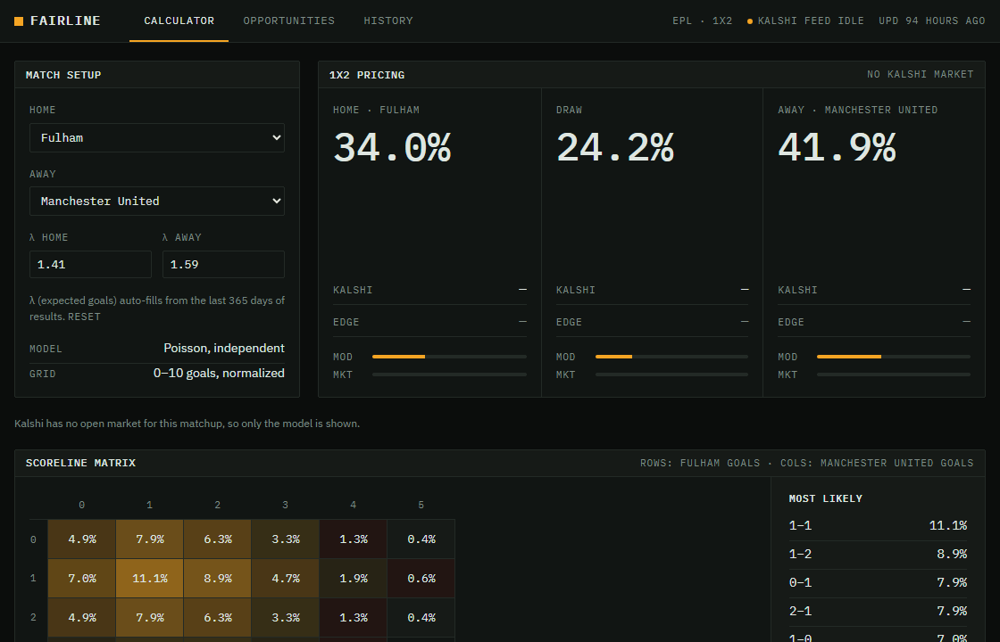
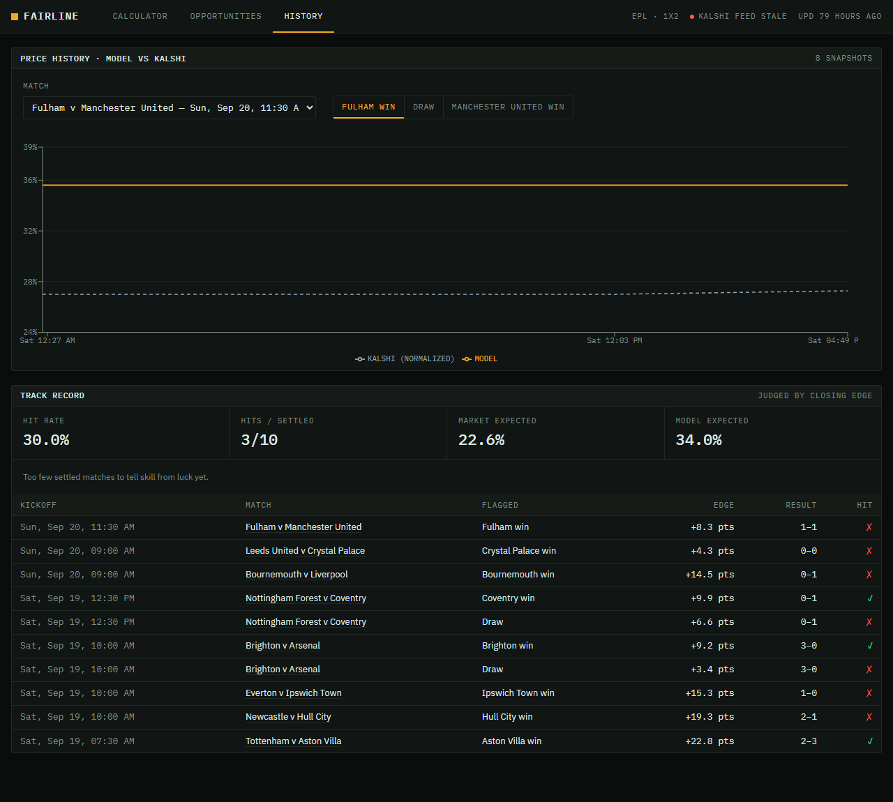

# Fairline

[](https://github.com/ianhndz14/fairline/actions/workflows/ci.yml)
[](LICENSE)

A full-stack probability modeling tool (Java/Spring Boot, React, PostgreSQL) that estimates sports outcomes with a Poisson distribution model built from scratch, and compares those estimates against live prediction-market prices to flag pricing inefficiencies.

## How it works

1. **Model** — A Poisson model estimates the probability of every possible outcome of an event from each team's historical scoring averages. It's implemented in plain Java with no external ML libraries, and the probabilities are normalized so they sum to 1.
2. **Market** — Prices for the same event are pulled from a prediction market ([Kalshi](https://kalshi.com)), with manual/CSV upload as a fallback, and stored as timestamped snapshots.
3. **Edge** — When the gap between the model's probability and the market's implied probability exceeds a configurable threshold, Fairline flags it as a potential +EV pricing inefficiency.



*Pick two teams, adjust expected goals, then compare the model with Kalshi's prices over time.*

## Screens

**Calculator** — expected goals (λ) auto-fill from a year of results and stay editable, the model's 1X2
probabilities sit next to Kalshi's normalized price, and the matrix shows every scoreline.

**History** — how the model and the market moved before kickoff, and how flagged outcomes actually turned out.
The hit rate is shown next to what the market itself expected, with a warning while the sample is too small to
mean anything.



## MVP scope

- **Sport:** Soccer — English Premier League
- **Market:** 1X2 match result (home win / draw / away win)
- **Out of scope for now:** other leagues, totals (over/under), handicaps, player props. These can be added after the MVP, since the same Poisson scoreline grid covers them.

## Tech stack

| Layer    | Technologies                                        |
| -------- | --------------------------------------------------- |
| Backend  | Java 21, Spring Boot 4, Spring Data JPA, Flyway        |
| Database | PostgreSQL                                          |
| Frontend | React 19, TypeScript, Vite, React Router, Recharts  |
| Testing  | JUnit 5, Spring Boot Test / MockMvc, Vitest, React Testing Library |
| Quality  | javac lint (warnings as errors), Spotless + Palantir Java Format, oxlint, Prettier |
| DevOps   | Docker, GitHub Actions                              |

## Project structure

```
fairline/
├── backend/    # Spring Boot API + Poisson probability engine
├── frontend/   # React + TypeScript web app
└── docs/       # Design notes (data sources, wireframes, deployment)
```

## Run it locally

Requires Java 21, Node.js 20.19+ and PostgreSQL.

1. Set up and start the backend: see [backend/README.md](backend/README.md). It serves the API on `http://localhost:8080`.
2. In a second terminal, start the frontend: see [frontend/README.md](frontend/README.md). Then open `http://localhost:5173`.

## Deployment

The API runs as a container on [Render](https://render.com) against a [Neon](https://neon.tech) PostgreSQL database,
with the frontend on [Vercel](https://vercel.com). Step-by-step instructions, environment variables and free-tier
caveats are in [docs/deployment.md](docs/deployment.md).

## Roadmap

Phases are ordered because each builds on the previous one. Phase 5 is optional.

### Phase 0 — Planning & setup
- [x] Pick one sport and market type for the MVP: Premier League, 1X2 match result
- [x] Review the Kalshi API docs and define a fallback: public API confirmed, manual/CSV upload kept as plan B ([findings](docs/data-sources.md))
- [x] Wireframe 3 screens: calculator, opportunities dashboard, history ([wireframes](docs/wireframes.md))
- [x] Create the repository with an initial README and folder structure

### Phase 1 — Probability engine (Poisson)
- [x] Implement the Poisson model in plain Java from each team's average goals/points
- [x] Normalize outcome probabilities so they sum to 1
- [x] Unit test with JUnit 5 against hand-calculated cases

### Phase 2 — Data model & persistence
- [x] Entities: `Event`, `Market`, `ModelEstimate`, `PriceSnapshot`, `EdgeLog`
- [x] Relationships and constraints in PostgreSQL via Spring Data JPA
- [x] Versioned schema migrations with Flyway

### Phase 3 — REST API & market data
- [x] Endpoints: load an event with stats, get the model estimate, list detected opportunities
- [x] Price ingestion (Kalshi API, or manual upload as fallback) stored as timestamped snapshots
- [x] Comparison logic: record an opportunity when model vs. market exceeds a configurable threshold

### Phase 4 — React frontend
- [x] Interactive calculator: enter match stats → instant estimated probabilities
- [x] Dashboard of +EV opportunities, sorted by edge size
- [x] Chart of model probability vs. market price over time (Recharts)

### Phase 5 — Authentication *(optional)*
- [ ] Basic login with Spring Security + JWT
- [ ] Per-user watchlists and saved preferences

### Phase 6 — Testing & quality
- [x] API tests for critical endpoints (Spring Boot Test / MockMvc)
- [x] Component tests for key frontend views (Vitest + React Testing Library)
- [x] Consistent linting and formatting across backend and frontend

### Phase 7 — CI/CD & deployment
- [x] GitHub Actions running all tests on every push (plus linting, formatting and a Docker image build)
- [ ] Deploy backend + database (Render + Neon) and frontend (Vercel) — config and steps ready in [docs/deployment.md](docs/deployment.md)
- [x] Environment variables and secrets kept out of the codebase

### Phase 8 — Polish
- [x] README with screenshots of the calculator and the history/track-record screens
- [x] Real metrics: resume bullets drafted in [docs/resume-bullets.md](docs/resume-bullets.md); accuracy numbers fill in as matches settle
- [ ] Link to the live demo
